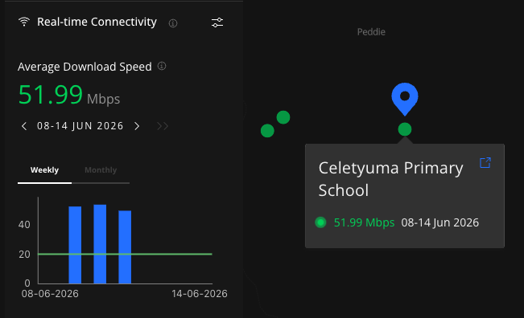
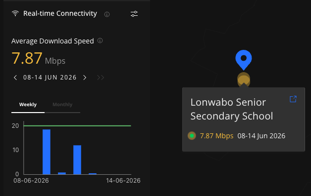
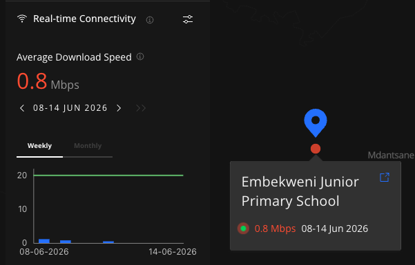

# FAQ

---

### How can I view my school's data?

You can view results in two ways:

1. **In the app** — the last 10 successful measurements are visible in the app's Data page.
2. **On Giga Maps** — visit [maps.giga.global/map](https://maps.giga.global/map), type your school name or ID in the left-hand panel, and select it to view results over time.

The dot next to each school is colour-coded by connectivity level:

**Green** — Good connectivity. The school meets or exceeds the selected benchmark.

<figure></figure>

**Yellow** — Moderate connectivity. The school is below the benchmark but has a working connection.

<figure></figure>

**Red** — Slow connectivity. The school is significantly below the benchmark.

<figure></figure>

A **blue** dot means no recent data has been received — the device may be off or the app may need reinstalling.

Copy the URL on your browser after selecting your school — you can bookmark it for direct access any time.

---

### What data does Giga Meter transmit to Giga?

The app transmits only network performance data. No browsing history, search activity, or personal files are ever collected.

| Field | Example | What it is |
|---|---|---|
| Download speed | 10 Mbps | Rate at which data travels from an M-Lab server to the device (NDT7 protocol, 10-second test) |
| Upload speed | 5.7 Mbps | Rate at which data travels from the device to an M-Lab server (NDT7 protocol, 10-second test) |
| Latency | 3 ms | Round-trip time for a small packet to travel from the device to a server and back |
| Packet loss | 0.5% | Percentage of data packets sent that never arrive at their destination |
| Uptime | 99% | Proportion of school hours (8 AM–8 PM) during which the connection is confirmed reachable, derived from automated pings |
| ISP / ASN | AS8193 Uzbektelekom | The internet service provider and their Autonomous System Number — a unique identifier assigned by global internet authorities |
| IP address | 84.54.71.31 | The public IP address assigned to the school's connection at the time of measurement |
| Test server location | Chennai, IN | Geographic location of the M-Lab measurement server used in the speed test |
| Device type | windows | Operating system running the measurement application |
| Network name (SSID) | MERCUSYS_43A4 | Name of the Wi-Fi network the device is connected to at the time of the test |
| Wi-Fi standard | 802.11n | Wi-Fi protocol version in use (802.11n = Wi-Fi 4, 802.11ac = Wi-Fi 5, 802.11ax = Wi-Fi 6) |
| Wi-Fi channel | 10 | Radio frequency channel the router is broadcasting on |
| Wi-Fi signal level | −70.5 dBm | Signal strength received by the device. Closer to 0 = stronger; below −80 dBm is poor |
| Wi-Fi transmit rate | 300 Mbps | Speed at which the device's wireless adapter sends data to the router — the wireless link rate, not the internet speed |
| Wi-Fi adapter model | Intel Wireless-AC 9560 | Hardware model of the Wi-Fi adapter inside the measurement device |

No personal data is ever transmitted.

---

### Will Giga have access to any other information on my computer?

No. The application does not have access to any data stored on your computer other than the data described above.

---

### Who will have access to my school connectivity data?

Upload speed, download speed, latency, and ping test results will be shared with the public in combination with information about the registered school. This data is displayed on Giga Maps. No personal data is shared.

---

### What is a School ID?

A School ID is a unique identifier for your school, provided by the government. Formats vary by country but it typically looks like `BR12345` or `12345678`.

---

### How do I find my School ID?

Ask your school administrator or IT department. The school ID is the number used in your national school registration system.

---

### Can I close the application?

Yes. Clicking the close button will close the window, but the app will continue running in the background and will keep reporting your connectivity status.

---

### How do I update the application?

When a new version is available, a notification pop-up will appear — click **Restart** to update. You can also visit [meter.giga.global](https://meter.giga.global/) at any time to download and install the latest version.

---

### When do speed tests run?

Up to four speed tests run per day:
- First test: within 15 minutes of the device being powered on
- Remaining tests: within the time slots 8 AM–12 PM, 12 PM–4 PM, and 4 PM–8 PM (local time)

Ping tests run every 15 minutes between 8 AM and 8 PM local time.

You can also trigger a manual test at any time.

---

### Where can I see past measurement results?

- **In-app:** Last 10 successful tests are shown in the measurement dashboard under the Data page.
- **Giga Maps:** Daily averages are published to [maps.giga.global](https://maps.giga.global/). Find your school to see how its connectivity compares globally.

---

### Can I change my school ID?

If you registered with the wrong school ID, you can unregister and re-register. See [Troubleshooting — Registered with the wrong school ID](troubleshooting.md#registered-with-the-wrong-school-id).

---

### Can I install Giga Meter on more than one computer?

Yes — and we encourage it. If multiple machines report data from the same school, measurements are more reliable.

---

### What kind of data does Giga Meter access?

Only system and network information needed to measure internet quality: connection speed, availability, network details, and device type. It does not access personal files, browsing history, or content.

---

### How does Giga Meter help improve internet access?

Giga Meter doesn't fix internet connections directly, but it makes problems visible. This data helps governments and providers identify and prioritize improvements where they're needed most.

---

For further guidance, visit [meter.giga.global](https://meter.giga.global/) or the help section directly in the app.
